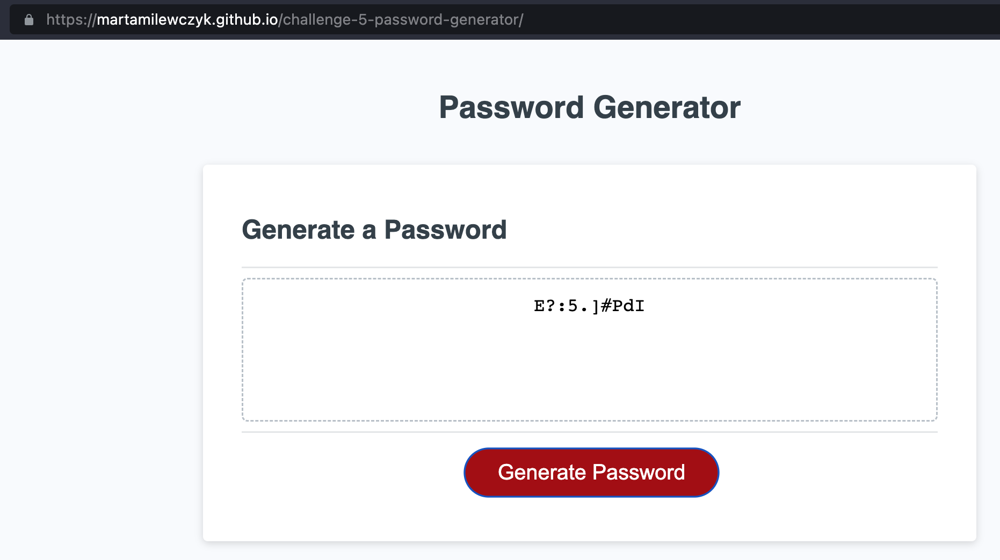

# challenge-5-password-generator
Javascript simple password generator

## Description

Project is a simple password generator application prepared in Javascript and displayed in HTML window.
Once red button is clicked, then app generates a password. Prompts allow to choose options for password 
and password length between 10 and 64 characters as well.

Character types

<ul>
    <li>Lowercase</li>
    <li>Uppercase</li>
    <li>Numeric</li>
    <li>Special characters ($@%&*, etc)</li>
</ul>

Code should validate for each input and at least one character type should be selected. Once prompts are answered then the password should be generated and displayed in an alert or written to the page.

## Installation

Application is deployed in <a href="https://martamilewczyk.github.io/challenge-5-password-generator">Github</a>

## Usage

Application view

## License
Project is licensed under the <a href="LICENSE">MIT License</a>.

---

